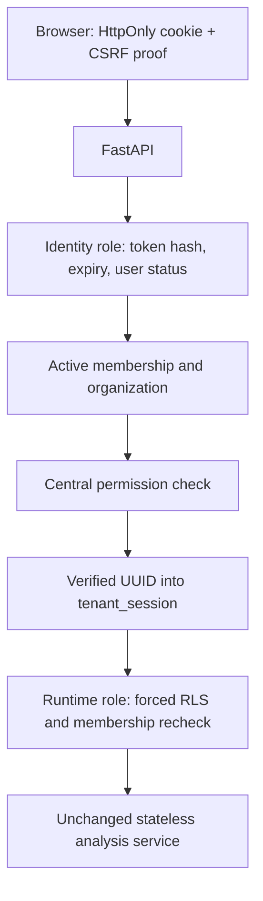

# Authentication architecture

This records Phase 2. Phase 3 reuses these identity/session boundaries for saved runs, adds
resource permissions, and rejects unauthorized uploads before body consumption. See
[persistent architecture](product-phase-3-report.md) for the current business-data path.

Product Phase 2 wraps the existing analysis services with authentication; it does not change their
calculations or persist financial uploads. The CLI remains independent of all optional packages.

## Starting point and work sequence

The accepted starting branch is `main` at `cecae36dce196a828c1e9aea083709342903db27`. Tracked files
are clean; the unrelated root `package-lock.json` remains untracked. The accepted counts are 280
Python tests (35 database), 32 frontend tests, and 15 browser/accessibility tests.

Implementation sequence: identity schema and security primitives; auth service and protected API;
frontend flows; real PostgreSQL/browser negative tests; final threat review, report, and commits.
The initial migration remains immutable. This phase is not pushed without a new explicit request.

The prompt left policy choices open. This implementation chooses explicit organization selection
for multiple memberships, Strict production cookies, generic 202 registration/recovery responses,
fixed temporary identifier windows, and narrowly scoped role-specific RLS policies rather than
SECURITY DEFINER. Existing Phase 1 users are preserved but not automatically activated as web
accounts. Development verification bypass is explicit and cannot be enabled in production.

## Decisions and trust boundaries

Passwords use Argon2id with 64 MiB memory, three iterations, and four lanes, with a random salt
managed by argon2-cffi and rehash-on-success support. This exceeds the currently published
[OWASP minimum](https://cheatsheetseries.owasp.org/cheatsheets/Password_Storage_Cheat_Sheet.html).
Passwords contain 15–128 Unicode code points, including spaces, with no trimming, Unicode
normalization, or composition rules. Login input is bounded too. Identity email uses the mature
email-validator library, then lowercase normalization to match the accepted database contract.

Credentials are one-to-one user records, not presentation fields. Session and email tokens use
32 random bytes (256 bits) and only their SHA-256 hashes are stored. Sessions have a 30-minute idle
timeout and a 12-hour absolute lifetime. Successful login replaces any incoming session; switching
organizations rotates the session and CSRF context without extending the absolute deadline. Reset
revokes every session. User, organization, and membership status are checked on each request.

Production cookies use `__Host-` names, Secure, HttpOnly, SameSite=Strict, Path=/, and no Domain.
Development uses separately named non-Secure cookies only with explicit `APP_ENV=development`.
Frontend and backend browser URLs must use the same hostname; production prefers one HTTPS origin.

### CSRF

Use signed, session-bound double submission following the
[OWASP guidance](https://cheatsheetseries.owasp.org/cheatsheets/Cross-Site_Request_Forgery_Prevention_Cheat_Sheet.html).
A bootstrap endpoint sets a random HttpOnly CSRF-context cookie and returns a random nonce plus an
HMAC-SHA256 signature bound to that cookie and the current session cookie. JavaScript holds only
this CSRF proof in memory and sends it in `X-CSRF-Token`. It cannot read the session cookie. All
state-changing browser routes also require an explicitly trusted Origin. Pre-auth login,
registration, recovery, reset, verification, and resend use the same mechanism before a session
exists. Login, logout, and organization selection rotate context. The signing key is private,
required configuration, never a development fallback or a browser value.

### Database roles

The migration owner is used only for DDL. `reconcile_identity` is a provisioned NOLOGIN group for
a separate non-owner, non-superuser, non-BYPASSRLS login. Role-specific policies permit identity
operations on users, credentials, sessions, email tokens, and throttle buckets. User updates are
column-limited to `email_verified_at`; status/email/name changes are not granted. It can read/create
organizations and memberships for atomic registration but cannot update their roles/statuses.
It has no procurement-table privileges. No SECURITY DEFINER functions are necessary.

The existing `reconcile_runtime` role and forced tenant RLS remain unchanged. A verified principal
is checked by a centralized permission map before its organization reaches `tenant_session`.
The resulting tenant transaction rechecks membership/organization state under RLS. Browser UUIDs
are selectors, never authorization. Only RUN_ANALYSIS is needed now; all three existing roles
have it. A sole active membership is selected at login. Multiple memberships require explicit
selection; zero memberships cannot run analysis.

### Mail and recovery

Registration creates user, credential, organization, and ORG_ADMIN membership in one transaction.
Its public acknowledgement is the same for an existing normalized email. It does not automatically
log the browser in. Production requires verification through a 24-hour, single-use token. Reset
tokens last 30 minutes. Reissue invalidates outstanding tokens of the same purpose. Reset token
consumption, password update, token invalidation, and session revocation share one transaction.

A small mailer interface separates SMTP from auth logic. Production requires configured SMTP over
TLS and verification enabled. A test in-memory mailer exercises real tokens without external email.
Explicit development may disable mail only with verification disabled; recovery delivery then is
unavailable and is not represented as working email. No console logger prints secret links. Links
carry tokens in the URL fragment, not the query string, keeping them out of HTTP access logs; the
frontend removes the fragment from history immediately. Delivery failures produce a sanitized
operational event, not a token/SMTP traceback or an account-existence signal; resend allows retry.

### Throttling and enumeration

PostgreSQL throttle buckets use HMAC fingerprints of normalized identifiers and operation names.
An atomic upsert plus row lock charges attempts before expensive password work across workers.
Defaults: five login attempts per 15-minute window and three registration/recovery/resend attempts
per hour. Successful login clears its bucket. There are no permanent lockouts. Unknown accounts
have the same buckets and generic responses; a dummy Argon2 verification covers unknown users.
This reduces obvious enumeration, not all timing side channels. Deployment must also impose
network-level rate/concurrency limits and an operational retention policy for expired auth state.

### HTTP and frontend

All five analysis routes require authentication, RUN_ANALYSIS, and CSRF, with unchanged successful
JSON. `/auth/me` returns only user identity, active memberships, and active organization. Sensitive
responses use `Cache-Control: no-store`; validation responses never echo passwords/tokens. CORS
uses an explicit origin allow-list with credentials and the CSRF header, never wildcard origins.
Production API documentation is disabled by default and is not an authorization control.

A small React provider bootstraps `/auth/me`; route guards are navigation UX, not API security.
One transport owns credentialed requests and CSRF bootstrap/rotation. No browser persistent
storage contains credentials or CSRF values. Login/register/recovery/verification pages and a
small organization/user/logout shell are the only new UI. There are no fake admin/history pages.
An expired verification link offers a direct resend form. A 401 clears frontend auth state; a
403 clears the cached CSRF proof for the next explicit attempt. POSTs are never silently replayed.
Concurrent initial CSRF bootstraps or another tab's rotation may cause a safe 403 requiring retry.

## Explicit limits

There is no MFA, SSO, member-management API, saved analysis history, or business CRUD. Database
identity-role compromise can compromise accounts; keeping it separate prevents direct procurement
reads but does not eliminate application-compromise risk. SMTP delivery is not a durable mail job
queue. An already running analysis is not retroactively canceled by membership revocation.
Production approval still requires deployment-specific threat review, network limits, tested
backups/retention, and operational monitoring. See the phase report for executed verification.
