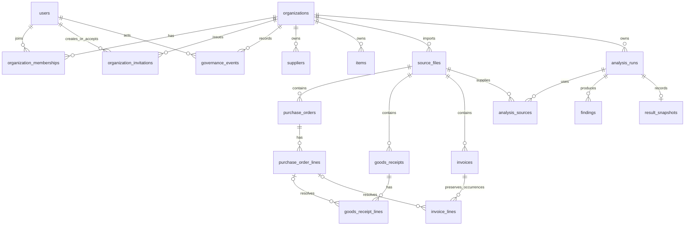

# Data model v1

This document records the Phase 1 schema decisions; the original baseline sections below are
historical. Phase 2 added identity; Phase 3 activates persistent runs; Phase 4 adds workflow;
Phase 5 adds a supporting activity index; and Phase 6 adds the identity-domain governance records
described below. CLI and explicit stateless APIs remain database-free for business results.

## Product Phase 6 extension

`0006` adds positive optimistic `version` columns, defaulting to 1, to `organizations` and
`organization_memberships`. Memberships retain ACTIVE/ARCHIVED state and MEMBER/AP_MANAGER/ORG_ADMIN
roles; no membership is hard-deleted. All member mutations lock the organization as a shared
serialization point before checking versions and the last-active-admin invariant.

The 23rd table, `organization_invitations`, belongs to the identity security domain. It stores the
organization, normalized email, intended role, SHA-256 token hash, creator, lifecycle timestamps,
PENDING/ACCEPTED/REVOKED state, optional accepting user, and positive version. Its constraints bind
creator/acceptor membership to the organization, enforce a 32-byte token hash and coherent state,
and permit only one pending invitation for an organization/email pair. History is retained.

The 24th table, `governance_events`, is an append-only organization activity source for rename,
member role/status, and invitation lifecycle events. Same-organization actor membership FKs,
bounded JSON metadata, SELECT/INSERT-only identity grants, and a trigger rejecting UPDATE/DELETE
protect it. Mutation and event share one identity transaction. The general admin timeline performs
a bounded keyset merge of this table with existing `audit_events` and `finding_events`; it does not
copy workflow comment or resolution bodies.

Both new tables use ENABLE/FORCE RLS policies restricted to `reconcile_identity`. That role gains
only column-level organization-name/version and membership-role/status/version updates plus the
narrow invitation/event grants. `reconcile_runtime` has no access to either new table and cannot
promote memberships. Downgrade is refused once governance history, invitations, or version changes
exist so an operator cannot silently erase Phase 6 state.

## Product Phase 5 extension

`0005` adds only `ix_finding_events_activity (organization_id, event_type, created_at)` to support
bounded manager activity queries. All 22 tables, persisted rows, workflow/evidence boundaries,
policies and grants remain unchanged. Dashboard counts are SQL read models, not stored metrics
or new monetary truth. See [the metric contract](dashboard-metrics.md) for cohort/window semantics,
the measured index rationale, pagination bounds and per-run financial exclusions.

## Product Phase 4 extension

`0004` evolves `findings`, not the report representation. Status is OPEN/IN_REVIEW/RESOLVED; new
fields are nullable `assignee_user_id`, `due_at`, `reminder_at`, `resolved_at`, `resolved_by_user_id`,
`resolution_note`, and positive `version` default 1. Composite membership FKs keep assignee and
resolver in the finding's organization. A resolution requires all three resolution fields;
non-resolved findings have none. Reopening clears only current resolution, retaining event history.
Runtime UPDATE is granted on those workflow fields and status/version only. Code, category,
organization, run and source references stay immutable. The existing timestamp trigger remains.

The 22nd table, `finding_events`, contains tenant/finding/actor/request UUIDs, event type, timestamps,
optional plain-text message (1–4000 characters) and JSON-object metadata (at most 2048 bytes).
Messages belong only to comments and resolutions. Composite actor-membership/finding FKs, forced
tenant RLS, SELECT/INSERT-only runtime grants, and an UPDATE/DELETE rejection trigger protect it.
State changes and events share one transaction. Comments append without changing finding version.
Indexes cover organization/status/assignee/due, organization/reminder, finding chronology, and
organization/finding/event chronology, alongside the existing organization/run/status index.

Due/reminder timestamps are timezone-aware; overdue/reminder-due flags are read-time computations.
No reminders worker, outbound delivery, payment approval, financial aggregation, or new master
record is created. Archived runs retain actionable findings and events. See [workflow architecture](product-phase-4-report.md).

## Product Phase 3 extension

`0003` leaves `0001`/`0002` intact. `analysis_runs` gains nullable `title` (120 characters),
`note` (4000), `archived_at`, and positive integer `version` (default 1). Archive cannot predate
creation. History has organization/archive/creation/id and organization/mode/archive/creation/id
indexes. Queries sort `created_at DESC, id DESC` with a bounded keyset cursor.

The 21st table, `audit_events`, carries organization, actor, event/resource type, run resource UUID,
server request UUID, timestamps, and at most 2048 bytes of JSON-object metadata. Composite FKs
bind the actor's membership and run to the same organization. Events are completion, metadata
update, archive, and restore. Runtime SELECT/INSERT only, forced RLS, and a row mutation trigger
protect the trail. No audit UI or system-actor event type is introduced.

One create transaction stores each source import, validated headers/lines, a completed run and
its real authenticated creator, analysis-source links, findings, snapshot, and completion event.
Hashes/byte counts describe original streamed bytes; sanitized basenames are display metadata,
never server paths. Physical CSV end-line positions preserve each occurrence, including multiline
records. Re-imports intentionally produce independent imports; hashes are not uniqueness keys.
Active same-organization master codes resolve when present; missing masters are not invented.
PO links resolve only against the source PO import in this run. Unknown references and duplicate
invoices remain evidence, not persistence failures. Storage range/encoding failures return `422`
and roll back rather than round, truncate, or silently omit values.

The snapshot, not findings, remains the authoritative mode-specific report. Partial/unreceived
PO states are not promoted to invoice exceptions. History never recomputes totals or calls the
engine. Snapshots retain report schema version 1 and the installed engine package version.
Source evidence, source links, and findings now deny runtime UPDATE. Run UPDATE is column-limited
to metadata/archive/version. The prior snapshot trigger and business DELETE restrictions remain.

Archive/restore keeps all evidence and changes metadata plus audit atomically. A row lock and
expected-version comparison reject stale mutations. Archive is reversible hiding, not deletion;
there is no purge API or retention scheduler. See [the Phase 3 report](product-phase-3-report.md)
and [retention/backup boundary](backup-restore.md).

## Decisions before implementation

- The accepted baseline is `main` at `ae8ba95`. The only starting untracked file is the unrelated
  root `package-lock.json`; it is preserved. Baseline tests: Python 195, Vitest 20, browser/axe 10.
- Invoice/receipt coverage uses `(po_number, po_line_number, item_code)`. Receipts have no supplier,
  currency, or agreed price. An absent exact key produces `MISSING_RECEIPT`; if receipts instead
  name a different item at that PO/line, it also produces `RECEIPT_ITEM_MISMATCH`. Exact coverage
  cannot verify commercial terms. Unrelated receipt evidence is not an invoice result; the
  fulfillment workflow is the place to inspect orphan receipts against provided orders.
- Duplicate invoice identity remains `(supplier_id, invoice_number, line_number)`. Each occurrence
  is reported; the maximum group exposure is counted once. An unambiguous group consumes its
  maximum quantity once; ambiguous targets consume nothing and receive no supported allocation.
- Receiving analysis distinguishes fully received, partial, not received, and over-received PO
  lines. Partial/not received are open fulfillment states, not invoice exceptions. Unresolved
  receipts are separately reported and never disappear into PO totals.
- Current loaders require consistent PO header supplier/date/currency and invoice date/currency.
  Receipt dates have no document-level consistency rule, so receipt dates remain on receipt lines.
- Domain decimal fields have no precision/scale ceiling. PostgreSQL unconstrained `NUMERIC`
  preserves their precision instead of silently rounding to a new fixed scale. Finite positive
  quantities and finite nonnegative prices are enforced with CHECKs. PostgreSQL's numeric size
  limits still apply; a future importer must report capacity errors rather than truncate data.
  Line numbers and source row positions use positive `BIGINT`, so values beyond its range must
  likewise fail explicitly at the future import boundary; the stateless loaders are unchanged.

## Entities and relationships

All IDs default to PostgreSQL-generated opaque UUIDs. Mutable records carry UTC-aware
`created_at`/`updated_at`; original source values and completed snapshots are historical evidence.

`organizations` have unique normalized slugs, a mutable display name, active/archived status, and
an optimistic version. `users` are
global identity records with normalized unique email, display name, and active/archived status;
they contain no credentials. `organization_memberships` uniquely pairs organization and user,
with a constrained MEMBER/AP_MANAGER/ORG_ADMIN role, ACTIVE/ARCHIVED state, and optimistic version.
Phase 6 administration uses the restricted identity service, not the tenant runtime role.

Suppliers and items have organization-local unique source codes and names/descriptions. They do
not model stock. Source-file metadata records type, original filename (metadata only, never a
path), size, SHA-256, and timestamp, without raw bytes or temporary paths.

PO and invoice headers belong to source imports. A document can be reimported without destroying
historical versions. PO numbers are unique within their source file; PO lines are unique within
their header. Receipt identities are unique per source import, with unique line numbers per
receipt. Invoice headers group supplier/invoice identity within one import; invoice lines have
unique source row positions, **not unique logical line numbers**. A nonunique header/line-number
index supports duplicate detection while preserving every occurrence.

Raw `source_po_number`, `source_po_line_number`, `source_item_code`, and `source_supplier_code`
remain separate from nullable resolved master-data/PO-line foreign keys. Unknown POs, wrong
items, supplier differences, excess quantities, and price differences are persistable evidence.
Resolution never rewrites source values. Strict loaders remain the source-validation boundary;
database constraints enforce structural integrity, not agreement between business documents.

Analysis runs have constrained mode and status, timestamps, and an optional creator referencing
membership in the same organization. Analysis sources associate a run with its validated imports.
Findings have constrained domain code/category/status and optional typed links to PO, receipt,
and invoice lines. A finding must have at least one subject. A run's immutable result snapshot
contains JSONB plus schema and engine versions; decimal values are strings. It complements
relational findings instead of replacing business tables. It can be inserted only for a completed
run; no update/delete is granted to the runtime role and a trigger rejects mutation.

## Ownership, constraints, and indexes

Every business table carries `organization_id`. Referenced tenant records expose a unique
`(organization_id, id)` pair; composite foreign keys prevent cross-organization links even when a
privileged database connection bypasses RLS. All organization and document relationships RESTRICT
deletion. There are no cascading business deletes. Archive master records; future retention jobs
must explicitly sequence purges after actor-aware approval and retention rules exist.

Each tenant table has an organization-leading index, generally its composite unique key. Additional
indexes cover source document lookup, logical invoice duplicate lookup, run chronology, and finding
run/status lookup. Status/role/mode, currency shape, positive line/source-row numbers, file sizes,
SHA-256 shape, and finite quantities/prices are database constraints. No constraint requires invoice
quantity/price/supplier/currency or receipt quantity to agree with a PO.

## RLS and role boundary

Tenant tables ENABLE and FORCE row-level security with both USING and WITH CHECK predicates on
`organization_id = NULLIF(current_setting('app.current_organization_id', true), '')::uuid`.
Organizations use their own `id`. Missing/reset context yields no readable/updatable rows and
rejects inserts. Invalid UUID context fails rather than granting access. Identity tables use
separate forced policies restricted to `reconcile_identity`; the runtime has no users access.

`tenant_session` owns one explicit transaction and sets context through bound `set_config(...,
true)`. It accepts a UUID representing an already verified organization; it does not authenticate
membership. The authorization layer verifies identity, active membership, and permission **before**
calling it. A browser organization ID is only a selector. No HTTP handler imports persistence.

Migration/schema ownership and runtime login are separate provisioned roles. Runtime is neither
superuser nor BYPASSRLS nor table owner. Administrator-provisioned `reconcile_runtime` is a NOLOGIN
privilege group; a provisioned runtime login receives membership. It has SELECT/INSERT/UPDATE on
business tables, SELECT/INSERT on snapshots, SELECT only on organizations/memberships, no users
access, no DELETE/TRUNCATE, and no schema CREATE. Role provisioning uses a privileged local/CI
administrator. The schema owner grants table privileges to the provisioned group. Do not deploy
requests with the migration URL.

The separate identity role performs authentication and organization governance. Phase 6 grants it
column-level UPDATE only on organization name/version and membership role/status/version,
SELECT/INSERT plus lifecycle-column UPDATE on invitations, and SELECT/INSERT only on governance
events. Runtime receives none of those capabilities; identity receives no procurement-table access.

RLS is defense in depth, not authentication: code with arbitrary SQL under the runtime login can
set the context. Runtime credentials must never reach a browser. Transaction-local context is
cleared on commit/rollback and tested on a single reused pooled connection.

## Migrations and future writes

Alembic is the sole schema installer; the initial migration freezes table definitions and policies.
It does not call mutable application metadata to create history. An administrator provisions the
database, schema owner, and runtime privilege group; no manual table/policy SQL is required.
Subsequent migrations must preserve source evidence and review backfills separately. Test clean
upgrade and metadata parity against real PostgreSQL, never SQLite.

Future import/save services own transactions: validate CSV, resolve within the verified tenant,
insert headers/occurrences/provenance, then commit once. Repository helpers must not commit.
Completed snapshots are immutable; reruns create new runs. Run, workflow, and governance event
models record actor, organization, event, resource type/ID, time, correlation ID, and bounded safe
metadata under separate transaction and privilege boundaries.
